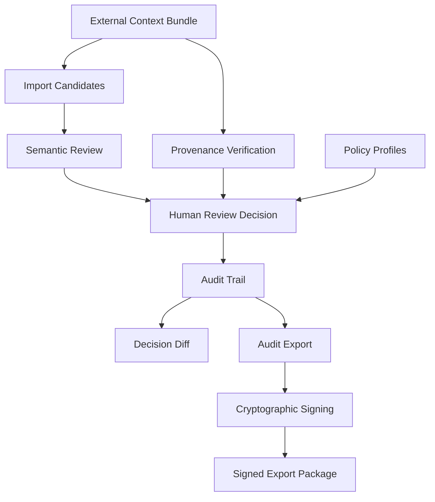

# Context Acceptance — Overall Architecture

```mermaid
flowchart TD
  A["External Context Bundle"] --> B["Import Candidates"]
  B --> C["Semantic Review"]
  C --> D["Human Review Decision"]
  D --> E["Audit Trail"]
  A --> F["Provenance Verification"]
  F --> D
  G["Policy Profiles"] --> D
  E --> H["Decision Diff"]
  E --> I["Audit Export"]
  I --> J["Cryptographic Signing"]
  J --> K["Signed Export Package"]
```
