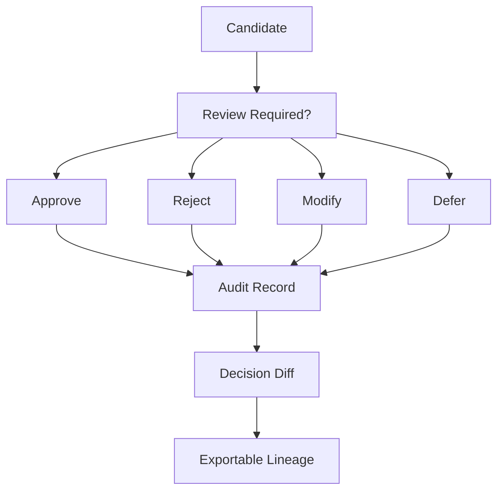

# Review Decision Flow

```mermaid
flowchart TD
  A["Candidate"] --> B["Review Required?"]
  B --> C["Approve"]
  B --> D["Reject"]
  B --> E["Modify"]
  B --> F["Defer"]
  C --> G["Audit Record"]
  D --> G
  E --> G
  F --> G
  G --> H["Decision Diff"]
  H --> I["Exportable Lineage"]
```
