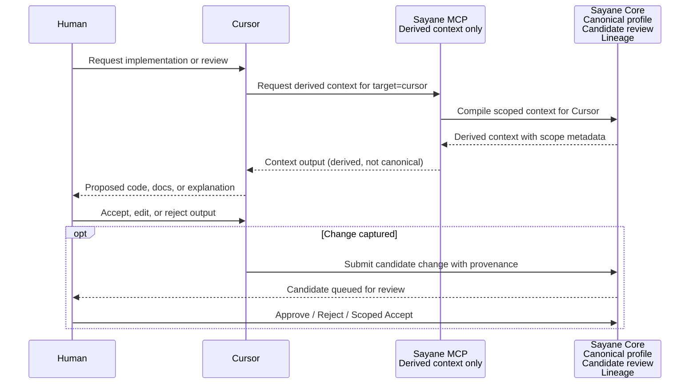

# Cursor MCP Usage Example

## Status

Example document.

This document provides non-normative usage examples for Cursor integration through Sayane MCP. The normative boundary is defined in [`cursor-acceptance-spec.md`](cursor-acceptance-spec.md).

All MCP requests and outputs in this document are **illustrative and planned**, not backed by a running implementation, unless explicitly noted.

## Purpose

This document demonstrates concrete, scenario-level examples of how Cursor and Sayane MCP interact while preserving Sayane's runtime-independent context governance.

Key points illustrated:

- Cursor is an AI coding runtime, not the context owner.
- Sayane MCP serves derived context, not the canonical profile.
- Cursor-originated changes pass through Candidate Update before merge.
- Agent output is provisional until reviewed.

This document is intended for both users and developers to understand the integration flow before implementation.

## Basic Flow



Key boundary in this flow:

- Sayane MCP never exposes the canonical profile.
- Every Cursor-originated change enters Candidate queue, not the profile directly.
- Human review is required before any profile or context change.

## Example 1: Requesting Derived Context

### Scenario

A developer opens Cursor to work on the Sayane project. Cursor needs project-level context but must not receive the full canonical profile.

### Illustrative request

The following is a **pseudo request** — it represents the intended shape of an MCP call, not a committed API.

```json
{
  "target": "cursor",
  "mode": "compact",
  "project": "sayane",
  "include_scope": true
}
```

### Illustrative output

The following is an **illustrative output** showing what derived context for Cursor should look like.

```markdown
## Derived context for Cursor

Source: Sayane Profile
Target: cursor
Mode: compact

Boundary:
This is derived context, not the canonical profile.

Project stance:
- local-first
- review before merge
- scoped context must not be promoted globally

Current task scope:
- docs/integrations/cursor-mcp-example.md
```

### What this example shows

- The canonical profile never leaves Sayane Core.
- Cursor receives a filtered, scoped, purpose-built view.
- The boundary statement is included in every output.

## Example 2: Scoped Context Output

### Scenario

A context entry has been accepted under `scoped_accept` for the Cursor integration documentation. Cursor requests project context for the `sayane` repository.

### Internal representation (for illustration)

```yaml
context:
  content: "Cursor should be treated as an execution runtime."
  accepted_scope:
    level: "project"
    target: "sayane"
    sub_scope: "cursor-integration-docs"
  conditions:
    - "Use only for Cursor integration documentation."
  negative_constraints:
    - "Do not treat this as a global preference for all IDEs."
    - "Do not promote to canonical profile without review."
  reuse_policy:
    review_on_reuse: true
```

### Illustrative output for Cursor

The MCP server compiles the internal representation into a scoped context note for Cursor:

```markdown
Scoped context note:

The following context is valid only for the Sayane Cursor integration docs.
It must not be treated as a global preference.

Context:
Cursor should be treated as an execution runtime.

Constraints:
- Do not use outside Cursor integration documentation.
- Do not promote to canonical profile.
- Re-review required if reused in a different scope.
```

### What this example shows

- Scoped context carries its scope, conditions, and negative constraints into the output.
- The context is clearly marked as scoped, not global.
- Cursor-side consumers can see the boundaries and reuse policy.

## Example 3: Cursor-Originated Change Becomes Candidate

### Scenario

While working on Cursor integration documentation, Cursor proposes a policy change that would affect Sayane's behavior.

### Cursor proposes

```text
Sayane should always generate Cursor Rules for every project.
```

### Sayane response

This change must not be auto-applied. It enters Candidate review.

### Review reasoning

```text
Candidate required.

Reason:
This changes Sayane's integration policy and may over-promote Cursor-specific behavior.

Risk:
- Cursor-specific policy may leak into global behavior.
- Rules may be mistaken for canonical profile.
- Future IDEs or runtimes would inherit a Cursor-biased default.
```

### Illustrative candidate record

```yaml
candidate:
  source: "cursor"
  type: "policy_update"
  proposed_change: "Generate Cursor Rules for every project."
  review_required: true
  suggested_decision: "reject_or_scoped_accept"
  risk:
    - "Cursor-specific policy may leak into global behavior."
    - "Rules may be mistaken for canonical profile."
    - "Non-Cursor runtimes would carry Cursor-biased policy."
```

### Possible outcomes

| Decision | Meaning |
|----------|---------|
| Reject | The change is discarded with a reason recorded in lineage. |
| Scoped Accept | The change is accepted but restricted to cursor-integration-docs scope. |
| Approve | Only valid if RDE/UIB evaluation confirms no deviation risk. |

### What this example shows

- Cursor-originated proposals are not auto-applied.
- Every change enters Candidate review with provenance metadata.
- RDE/UIB risk assessment is performed before any decision.
- Scoped accept is available as a middle ground.

## Example 4: Agent Output Is Not Accepted Knowledge

### Scenario

Cursor Agent explains why a refactoring decision was made. The explanation contains a claim about Sayane's direction.

### Agent says

```text
This module should be split because Sayane is becoming Cursor-first.
The architecture should prioritize Cursor Rules generation over other outputs.
```

### Sayane treatment

```text
Do not accept as fact.
Capture as candidate only if the claim is independently useful.
Evaluate whether the claim is supported by RDE/UIB review.
Reject if it narrows Sayane's runtime-independent design.

Assessment:
- Claim: "Sayane is becoming Cursor-first" → Unsupported. Rejected.
- Claim: "Architecture should prioritize Cursor Rules" → Candidate captured for review.
- Risk: Accepting this as-is would violate Gate 7 (Repository Boundary).
```

### Illustrative candidate (partial capture)

```yaml
candidate:
  source: "cursor"
  type: "agent_output"
  original_claim: "Architecture should prioritize Cursor Rules generation."
  captured_for_review: true
  auto_accepted: false
  risk:
    - "Prioritizing Cursor Rules generation may narrow Sayane's runtime-independent design."
    - "Agent claim lacks lineage and supporting context."
```

### What this example shows

- Agent output is provisional, not accepted knowledge.
- Claims are evaluated individually, not accepted in bulk.
- Unsupported or boundary-violating claims are rejected.
- Useful fragments may be captured as candidates but still require review.

## Non-goals

This document does not:

- Define a stable MCP API.
- Require Cursor-specific code in Sayane Core.
- Define Cursor Rules generation.
- Automatically import Cursor output into Sayane Profile.
- Create or require a `sayane-cursor` repository.

## Example Checklist

- [ ] Derived context is clearly distinguished from canonical profile.
- [ ] Scoped context keeps scope, conditions, and negative constraints.
- [ ] Cursor-originated changes become Candidate Updates before merge.
- [ ] Cursor Rules are not treated as Sayane Profile.
- [ ] Agent output is not accepted without review.
- [ ] No Cursor-specific assumptions leak into Sayane Core.

## Next Implementation Candidates

1. Verify current MCP output modes for `target=cursor`.
2. Add a fixture for derived Cursor context output.
3. Add a fixture for scoped context output.
4. Add a candidate capture example for Cursor-originated changes.
5. Decide whether Cursor Rules generation belongs in Sayane Core or a future `sayane-cursor` repository.
