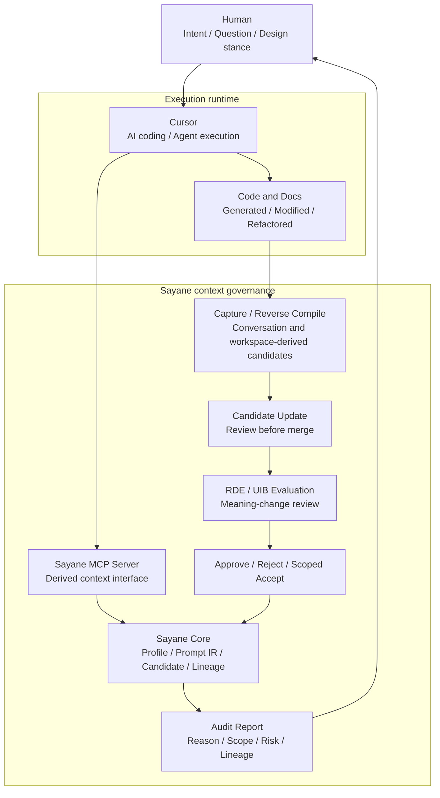
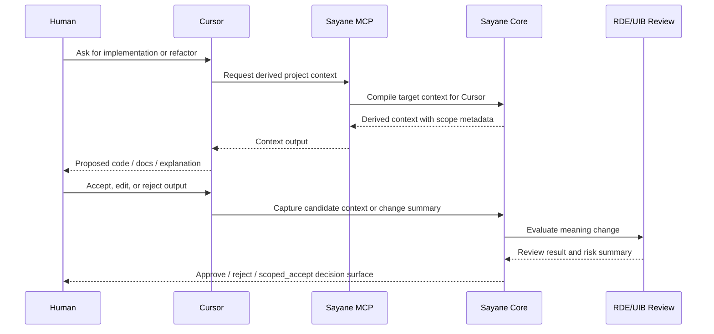

# Cursor Integration Concept

## Status

Concept document.

This document defines how Sayane should integrate with Cursor without making Cursor the owner of Sayane's context model.

## Purpose

Cursor is an AI-native coding environment. It accelerates implementation by connecting a human developer, an AI agent, and a project workspace.

Sayane is a local-first context and audit layer. It preserves persona, project context, prompt intent, candidate updates, lineage, and meaning-change review across LLM workflows.

The purpose of the Cursor integration is not to turn Sayane into a Cursor-specific tool. The purpose is to let Cursor act as one execution runtime while Sayane remains the context authority and audit surface.

```text
Cursor accelerates intelligence execution.
Sayane observes and governs intelligence change.
```

## Background

Sayane already treats LLMs and AI tools as runtimes rather than owners of persona or context.

Cursor should follow the same rule:

```text
Cursor is not the owner of the user's context.
Cursor is a runtime that receives derived context from Sayane.
```

This preserves Sayane's core design principle: separate persona and context from any single vendor memory, chat service, editor, or coding agent.

## Scope

In scope:

- Compiling Sayane context for Cursor through MCP or target-specific adapters
- Preserving scoped context metadata when context is sent to Cursor
- Recording Cursor-originated changes as candidate updates before merge
- Evaluating Cursor-generated changes through RDE / UIB review
- Keeping lineage for accepted and rejected context changes
- Documenting Cursor-specific integration behavior

Out of scope:

- Making Cursor the canonical profile store
- Auto-merging Cursor agent output into Sayane Profile
- Treating Cursor rules as global user preferences
- Building a Cursor-only architecture inside Sayane Core
- Moving Sayane's main product identity toward a single IDE integration

## Conceptual Architecture



## Layer Responsibilities

### Cursor

Cursor is responsible for:

- AI-assisted coding
- Agent execution
- Workspace-local implementation support
- Developer interaction inside the editor

Cursor is not responsible for:

- Canonical persona ownership
- Final context acceptance
- Cross-runtime context governance
- Long-term meaning-change lineage

### Sayane MCP Server

The MCP server is the stable integration surface for Cursor and other MCP-compatible clients.

It should expose derived context, not the canonical profile itself.

The MCP output must preserve scope, conditions, negative constraints, reuse policy, and promotion limits when context has been accepted through scoped acceptance.

### Sayane Core

Sayane Core remains responsible for:

- Sayane Profile
- Prompt IR
- Candidate updates
- Evaluation results
- Lineage records
- Context compilation policy

Cursor-specific assumptions must not leak into Sayane Core.

### Candidate / RDE / UIB

Cursor-originated changes should become candidates first.

They should be reviewed as meaning changes, not merely accepted as useful output.

The review should ask:

- What intent was preserved?
- What intent was transformed?
- What context was added?
- What remains unresolved?
- What deviation risk was introduced?
- Is the change local, project-scoped, or globally valid?

## Integration Flow



## Naming Policy

The main repository should remain `sayane`.

A separate `sayane-cursor` repository should be created only when Cursor-specific code becomes large enough to pollute the main repository boundary.

Recommended future split:

```text
sayane          # Core context, Prompt IR, candidate review, lineage, MCP
sayane-cursor   # Cursor-specific extension, workspace adapter, rules generator
sayane-pro      # Commercial features
```

Until that threshold is reached, Cursor integration should live under documentation and integration modules inside the main repository.

## Repository Boundary

Current recommended structure:

```text
sayane
  docs/
    integrations/
      cursor.md
  sayane/
    mcp/
    core/
    evaluation/
    capture/
```

Possible future structure:

```text
sayane
  sayane-core
  sayane-cli
  sayane-bridge
  sayane-mcp
  sayane-capture
  sayane-eval

sayane-cursor
  cursor-extension
  cursor-rules
  workspace-capture
  cursor-agent-log-adapter
```

## RDE Difference Review

### Preserved elements

- Sayane remains local-first.
- Sayane Profile remains canonical.
- Cursor is treated as a runtime, not as a context owner.
- Candidate review remains human-centered.
- RDE / UIB remain review disciplines rather than automatic truth oracles.

### Transformed elements

- Cursor integration shifts Sayane from generic prompt portability toward active AI IDE governance.
- MCP becomes more important as the stable editor-facing interface.
- Context compilation must handle project-scoped and tool-scoped output more explicitly.

### Complemented elements

- Cursor provides a concrete high-value runtime for Sayane.
- Sayane provides Cursor with context sovereignty, lineage, and meaning-change review.
- The combination clarifies Sayane's role as governance layer above AI-native execution tools.

### Unresolved elements

- Whether Cursor-specific UI should remain documentation-only, MCP-only, or become an extension.
- How much workspace diff information should be captured.
- Whether agent logs can be captured reliably and safely.
- How project-scoped context should be displayed inside Cursor without becoming global instruction.

### Deviation risks

- Cursor-specific assumptions may leak into Sayane Core.
- Cursor Rules may be mistaken for canonical Sayane Profile.
- Agent output may be treated as accepted knowledge without review.
- Scoped project context may be promoted into global persona context.

### Next update policy

The next implementation step should be small:

1. Keep the current repository as the main Sayane repository.
2. Add Cursor integration documentation.
3. Verify current MCP behavior against Cursor use cases.
4. Add target-specific examples only after the MCP boundary is confirmed.
5. Split `sayane-cursor` only if Cursor-specific implementation begins to distort the main repository.

## Core Statement

```text
Cursor writes with intelligence.
Sayane remembers with review.
```
