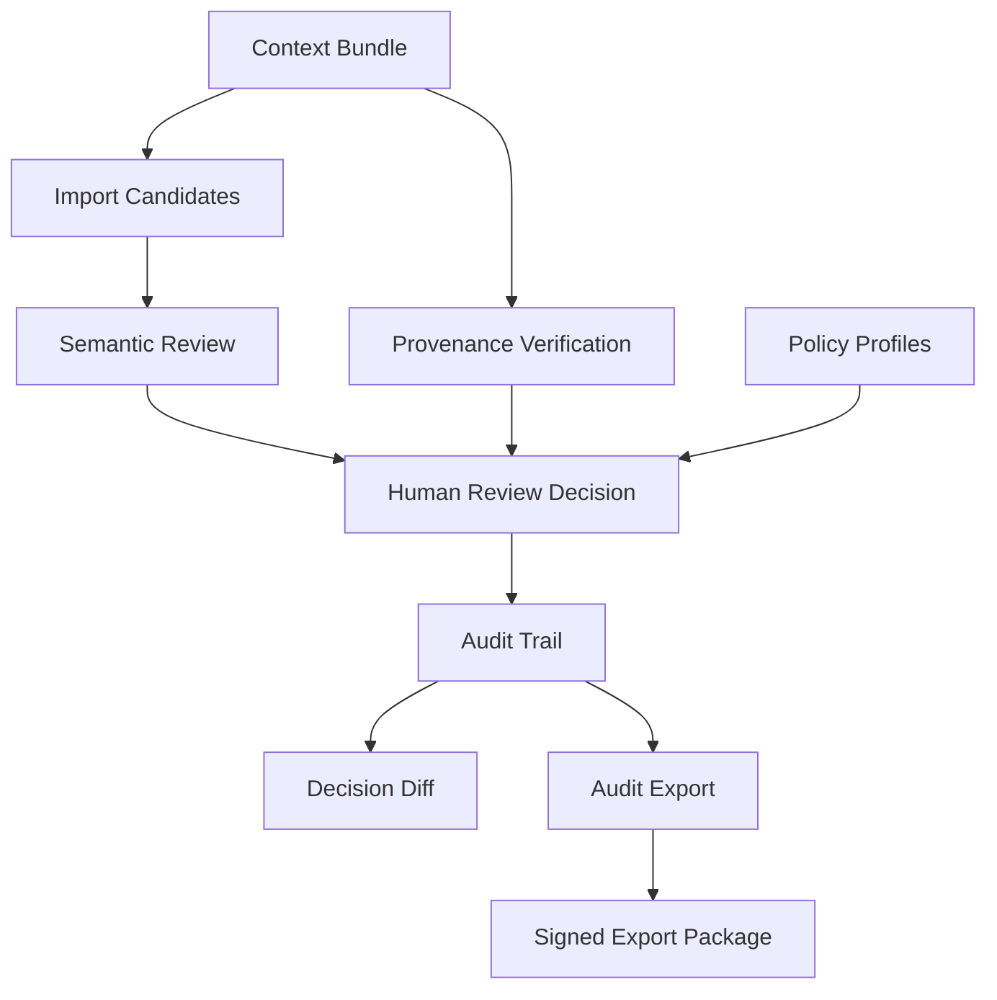

# Phase 6–17 Release Closure

## Context Acceptance, Auditability, and Verifiable Handoff

**Status**: closed_with_notes
**Date**: 2026-06-05

---

## Summary

Phase 6–17 transformed Sayane from a context portability prototype into an auditable context acceptance and handoff system. The implemented flow covers semantic review, human review decisions, audit trail, provenance verification, regression reporting, policy profiles, provenance-aware review surfaces, decision diff viewing, audit export, custom policy files, cryptographic signing, and signed export packages.

Phase 6〜17 により、Sayane は単なる文脈可搬性プロトタイプから、文脈を候補として受け取り、人間が判断し、その判断を監査可能な来歴として残し、検証可能な単位で外部へ渡す基盤へ進んだ。

**Sayane は真偽を自動判定しない。候補を自動承認しない。人間の判断を置き換えない。**

---

## Phase Summary

| Phase | Theme | Status | Core Output |
|---:|---|---|---|
| 3-5 | Export / Baseline / Round-trip | Complete | ChatGPT/Claude transfer, import-to-candidates |
| 6 | Semantic Review | closed_with_notes | Overlap / placement / boundary detection |
| 7 | Review Workflow | closed_with_notes | approve / reject / modify / defer |
| 8 | Audit Trail | closed_with_notes | Append-only review decision records |
| 9 | Bundle Provenance | closed_with_notes | Metadata, hash, verification |
| 10 | Regression Dashboard | closed_with_notes | transfer-report |
| 11 | Policy Profiles | closed_with_notes | strict / standard / legacy / development |
| 12 | Provenance-aware UI | closed_with_notes | review show/list/overlap detail |
| 13 | Decision Diff Viewer | closed_with_notes | review diff / audit diff |
| 14 | Audit Export | closed_with_notes | markdown / json / jsonl export |
| 15 | Custom Policy Files | closed_with_notes | policy validate / show --file |
| 16 | Cryptographic Signing | closed_with_notes | Ed25519 signing / verification |
| 17 | Signed Export Package | closed_with_notes | package create / inspect / verify |

---

## Architecture Summary



### Layers

| Layer | Components |
|---|---|
| Context Transfer | export, import, round-trip bundles |
| Semantic Review | overlap, placement, boundary detection |
| Human Review | approve/reject/modify/defer with reason |
| Audit | append-only store, decision records, diff |
| Provenance | metadata, content hash, verification |
| Policy | built-in profiles, custom files, hard constraints |
| Review Surface | CLI show/list/overlap/diff |
| Export & Handoff | audit export, signing, signed packages |

---

## Boundary Statements

- Sayane does not automatically accept candidates.
- Sayane does not automatically reject candidates.
- Sayane does not judge whether imported context is true.
- Sayane does not treat external profiles as memory.
- Sayane does not treat signatures as truth claims.
- Sayane does not treat verified packages as automatic acceptance.
- Sayane preserves human review boundaries.
- Sayane records rejected and deferred candidates as meaningful lineage.

### 境界宣言（日本語）

- Sayane は候補を自動承認しない。
- Sayane は候補を自動棄却しない。
- Sayane は取り込まれた文脈の真偽を自動判定しない。
- Sayane は外部 profile を memory として扱わない。
- Sayane は署名を真実性の証明として扱わない。
- Sayane は verified package を自動受容として扱わない。
- Sayane は人間の review 境界を保持する。
- Sayane は reject / defer された候補も意味ある来歴として残す。

---

## CLI Summary

### Review
```bash
sayane review show <candidate-id>
sayane review list --filter semantic_overlap
sayane review overlap <overlap-id>
sayane review diff <candidate-id>
```

### Audit
```bash
sayane audit list
sayane audit by-candidate <candidate-id>
sayane audit by-term RDE
sayane audit export --format markdown|json|jsonl
```

### Bundle / Provenance
```bash
sayane bundle-verify <bundle>
```

### Policy
```bash
sayane policy list
sayane policy show strict
sayane policy validate --file examples/policies/ci-strict.yaml
```

### Signing
```bash
sayane key generate
sayane key list
sayane sign bundle.yml
```

### Package
```bash
sayane package create --bundle bundle.yml --audit-export audit.json -o pkg/
sayane package inspect pkg/
sayane package verify pkg/
```

---

## Test Summary

| Phase | Tests |
|---:|---:|
| 6 | 6 |
| 7 | 12 |
| 8 | 10 |
| 9 | 10 |
| 10 | 6 |
| 11 | 11 |
| 12 | 8 |
| 13 | 9 |
| 14 | 10 |
| 15 | 8 |
| 16 | 9 |
| 17 | 8 |
| **Total** | **107** |

Full suite: 462 passed, 10 pre-existing failures, 0 Phase regressions.

---

## RDE Consistency Check

### Preserved
- External context boundary
- Human review boundary
- Candidate gate
- Rejected/deferred candidates in audit
- Signatures as integrity evidence, not truth claims
- Verified packages as handoff units, not acceptance units

### Transformed
- Context portability → context acceptance with review, audit, provenance, policy, handoff
- Individual artifacts → verifiable package units
- Review decisions → exportable/inspectable lineage

### Complemented
- Semantic review, review workflow, append-only audit, bundle provenance
- Regression reporting, policy profiles, custom policy files
- Cryptographic signing, signed export packages

### Intentionally Unresolved
- Remote trust model
- Organization key distribution
- Encrypted export package
- Cross-instance audit import
- Graphical production UI
- Legal non-repudiation
- LLM-based semantic judgement

### Deviation Risks
- Signature may be mistaken for truth
- Verified package may be mistaken for automatic acceptance
- Policy may be mistaken for semantic judgement
- Export may hide rejected candidates if implemented incorrectly

---

## Non-goals / Not Claimed

- Fully autonomous context acceptance
- Automatic truth judgement
- Automatic candidate approval/rejection
- Legal non-repudiation
- Organization-wide trust distribution
- Remote trust network / certificate authority
- Encrypted export package
- Cross-instance audit import
- LLM-based policy judgement
- LLM-based semantic diff as source of truth

---

## Next Phase Candidates

- Cross-instance Audit Import
- Encrypted Export Package
- Organization Key Trust Model
- Transfer Regression HTML Dashboard
- Public Narrative / Architecture Diagram Pack
